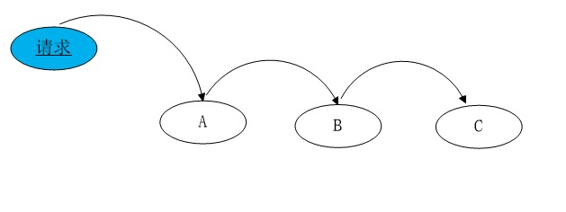

# 职责链模式

> 参考 《JavaScript设计模式与开发实践》- 曾探，强烈推荐这本书。

## 定义

避免请求发送者与接收者耦合在一起，让多个对象都有可能接收请求，将这些对象连接成一条链，并且沿着这条链传递请求，直到有对象处理它为止。



上图就是职责链模式的形象表示。

## 场景

**现实工作中的场景:**

例子1: 

假设一个团队有 **产品+设计+前端+后端+测试**，并且规定每次任务都要从产品开始接入，不能私下自己找人，现在临时需要做一张海报效果图，毫无疑问，这需要由**设计师**来完成，但是发布任务的人只需要把任务往第一个节点(产品)丢就行了，不需要知道具体是谁来处理。

* 任务1：做一张海报效果图

任务发布-产品(不是我)-设计(是我)，这样任务就在设计师这个节点处理。

* 任务2: 数据库数据处理

任务发布-产品(不是我)-设计(不是我)-前端(不是我)-后端(真倒霉，是我！)

例子2:

在早晚高峰挤公交的时候，由于人太多，找不到售票员，于是把手里的一块钱让别人帮忙往前面传递，最终钱传到售票员手里。

以上就是现实中的职责链模式，任务交给第一个节点，并沿着链条传递，直到有人能处理它为止。

## 怎么写

> [参考文章]('http://techblog.sishuxuefu.com/atricle.html?5bd5c9a744d904005ec72d43')

例如：对于一个网上商城，会员有A, B, C三个等级，A等级会员购物打8折，B等级会员购物打9折，C等级会员购物打95折。

根据职责链模式的原则，当第一个接收者对象无法处理请求时，则把请求交给下一个接收者对象。

``` 
// 1.定义好各个节点
const shoppingA = (grade ) => {
    if(grade === 'A') {
        console.log( `你的等级是${grade},你享受八折优惠` )
    } else {
        return 'nextSuccessor'
    }
}

const shoppingB = (grade) => {
    if(grade === 'B') {
        console.log( `你的等级是${grade},你享受九折优惠` )
    } else {
        return 'nextSuccessor'
    }
}

const shoppingC = (grade) => {
    if(grade === 'C') {
        console.log( `你的等级是${grade},你享受九五折优惠` )
    } else {
        return 'nextSuccessor'
    }
}

// 2. 创建一个链条的类，用来连接各个节点
class Chain {
    constructor(fn){
        this.fn = fn
        this.successor = null
    }

    // 设置下一个节点
    setNextSuccessor(successor) {
        return this.successor = successor
    }

    // 任务到达该节点的时候的处理办法
    passRequest(grade) {
        var ret = this.fn(grade) 
        if(ret === 'nextSuccessor') {
            return this.successor && this.successor.passRequest.apply(this.successor, arguments)
        }
        return ret
    }
}

// 3. 调用
const chainA = new Chain(shoppingA) // 实例化A节点
const chainB = new Chain(shoppingB) // 实例化B节点
const chainC = new Chain(shoppingC) // 实例化C节点


chainA.setNextSuccessor(chainB) // A节点的下一节设置为B
chainB.setNextSuccessor(chainC) // B节点的下一节设置为C
// 现在这个链条就是 chainA-chainB-chainC


// 把 'A', 'B', 'C' 等参数直接往第一个节点 chainA传入即可

chainA.passRequest('A') -> 你的等级是A,你享受八折优惠
chainA.passRequest('B') -> 你的等级是B,你享受九折优惠
chainA.passRequest('C') -> 你的等级是C,你享受九五折优惠

// 4. 假设有一天，需要增加 'S' 级别的会员打五折，只要增加一个节点即可

// 先添加一个具体的打折方法
const shoppingS = (grade) => {
    if(grade === 'S') {
        console.log( `你的等级是${grade},你享受五折优惠` )
    } else {
        return 'nextSuccessor'
    }
}

// 然后再原来的节点后面增加一个 S 节点
const chainS = new Chain(shoppingS)
chainC.setNextSuccessor(chainS)

```

职责链模式就像一根链条，能够灵活的增加、删除和修改其中的节点。

## 为什么要用？

可能有人会说，上面写这么多，不如直接 if-else 一把梭更方便。

于是写出如下代码

```
function shopping(grade){
    if(grade === 'A'){
        console.log('你的等级是${grade},你享受八折优惠')
    } else if(grade === 'B'){
        console.log('你的等级是${grade},你享受九折优惠')
    } else if(grade === 'C'){
        console.log('你的等级是${grade},你享受九五折优惠')
    }
}
```
这岂不是简单清晰明了？

假设现在需要增加 'S' 级别的会员，打五折，就需要到shopping函数内部进行的修改。这种修改方式违反了开放-封闭原则，若以后需要增加其他的级别的会员，会使得 ```shopping``` 函数变得非常的臃肿。

以上例子只有一个变量影响因素，不能很强烈的表现出职责链模式的优势，意在让我们先了解职责链模式，请看下面的经典例子。

## 经典例子

假设我们负责一个售卖手机的电商网站，经过分别交纳 500 元定金和 200 元定金的两轮预定后(订单已在此时生成)，现在已经到了正式购买的阶段。
公司针对支付过定金的用户有一定的优惠政策。在正式购买后，已经支付过 500 元定金的用 户会收到 100 元的商城优惠券，200 元定金的用户可以收到 50 元的优惠券，而之前没有支付定金的用户只能进入普通购买模式，也就是没有优惠券，且在库存有限的情况下不一定保证能买到。

```
// 未使用职责链模式
var order = function( orderType, pay, stock ){
    if ( orderType === 1 ){ // 500 元定金购买模式
        if ( pay === true ){ // 已支付定金
            console.log( '500 元定金预购, 得到 100 优惠券' );
        } else{ // 未支付定金，降级到普通购买模式
            if ( stock > 0 ){ // 用于普通购买的手机还有库存
                console.log( '普通购买, 无优惠券' );
            }else{
                console.log( '手机库存不足' );
            } 
        }
    } else if ( orderType === 2 ){ 
        if ( pay === true ){ // 200 元定金购买模式
            console.log( '200 元定金预购, 得到 50 优惠券' ); 
        }else{
            if ( stock > 0 ){
                console.log( '普通购买, 无优惠券' );
            }else{
                console.log( '手机库存不足' );
            } 
        }
    } else if (orderType === 3) {
        if ( stock > 0 ){
            console.log( '普通购买, 无优惠券' ); 
        } else{
            console.log( '手机库存不足' ); 
        }
    } 
};
order( 1 , true, 500); // 输出: 500 元定金预购, 得到 100 优惠券

```
虽然得到了意料中的运行结果，但是 order 函数不仅巨大到难以阅读，而且需要经常进行修改。虽然目前能正常运行，但是接下来的维护工作无疑是个梦魇。

现在，我们用职责链模式来重构代码

思路: 先把 500 元订单、200 元订单以及普通购买分成 3 个函数。
接下来把 orderType、pay、stock 这 3 个字段当作参数传递给 500 元订单函数，如果该函数不符合处理条件，则把这个请求传递给后面的 200 元订单函数，如果 200 元订单函数依然不能处理该请求，则继续传递请求给普通购买函数。


```
var order500 = function( orderType, pay, stock ){ 
    if ( orderType === 1 && pay === true ){
        console.log( '500 元定金预购，得到 100 优惠券' ); 
    } else{
        return 'nextSuccessor'; // 我不知道下一个节点是谁，反正把请求往后面传递 
    }
};
var order200 = function( orderType, pay, stock ){ 
    if ( orderType === 2 && pay === true ){
        console.log( '200 元定金预购，得到 50 优惠券' ); 
    } else{
        return 'nextSuccessor'; // 我不知道下一个节点是谁，反正把请求往后面传递 
    }
};
var orderNormal = function( orderType, pay, stock ){
    if ( stock > 0 ){ 
        console.log( '普通购买，无优惠券' ); 
    } else{
        console.log( '手机库存不足' ); 
    }
};

// Chain.prototype.setNextSuccessor 指定在链中的下一个节点
// Chain.prototype.passRequest 传递请求给某个节点
var Chain = function( fn ){
    this.fn = fn;
    this.successor = null; 
};
Chain.prototype.setNextSuccessor = function( successor ){ 
    return this.successor = successor;
};
Chain.prototype.passRequest = function(){
    var ret = this.fn.apply( this, arguments );
    if ( ret === 'nextSuccessor' ){
        return this.successor && this.successor.passRequest.apply( this.successor, arguments );
    }
    return ret; 
};
var chainOrder500 = new Chain( order500 );
var chainOrder200 = new Chain( order200 );
var chainOrderNormal = new Chain( orderNormal );

chainOrder500.setNextSuccessor( chainOrder200 ); 
chainOrder200.setNextSuccessor( chainOrderNormal);

chainOrder500.passRequest( 1, true, 500 );   // 输出:500 元定金预购，得到 100 优惠券
chainOrder500.passRequest( 2, true, 500 );   // 输出:200 元定金预购，得到 50 优惠券
chainOrder500.passRequest( 3, true, 500 );   // 输出:普通购买，无优惠券
chainOrder500.passRequest( 1, false, 0 );    // 输出:手机库存不足

```

通过改进，我们可以自由灵活地增加、移除和修改链中的节点顺序，假如某天网站运营人员 又想出了支持 300 元定金购买，那我们就在该链中增加一个节点即可。
```
var order300 = function(){
 // 具体实现略
};
chainOrder300= new Chain( order300 ); 
chainOrder500.setNextSuccessor( chainOrder300); 
chainOrder300.setNextSuccessor( chainOrder200);

```

## 异步职责链
在现实开发中，我们经常会遇到一些异步的问题，比如我们要在节点函数中发起一个 `ajax` 异步请求，异步请求返回的结果才能决定是否继续在职责链中 passRequest。
这时候让节点函数同步返回"nextSuccessor"已经没有意义了，所以要给 `Chain` 类再增加一个原型方法 `Chain.prototype.next`，表示**手动传递**请求给职责链中的下一个节点。
```
Chain.prototype.next= function(){
    return this.successor && this.successor.passRequest.apply( this.successor, arguments );
};
/* 异步职责链 */
var fn1 = new Chain(function(){
   console.log( 1 );
   return 'nextSuccessor';
});
var fn2 = new Chain(function(){ 
    console.log( 2 );
    var self = this; 
    setTimeout(function(){
        self.next(); //异步返回结果后传递给下一个节点！！ 
    }, 1000 );
});
var fn3 = new Chain(function(){
    console.log( 3 );
});
fn1.setNextSuccessor( fn2 ).setNextSuccessor( fn3 ); 
fn1.passRequest();
```

现在我们得到了一个特殊的链条，请求在链中的节点里传递，但节点有权利决定什么时候把 请求交给下一个节点。可以想象，异步的职责链加上命令模式(把 ajax 请求封装成命令对象)，我们可以很方便地创建一个异步 ajax 队列库。

## 用AOP实现职责链
```
Function.prototype.after = function( fn ){ 
    var self = this;
    return function(){
        var ret = self.apply( this, arguments ); 
        if ( ret === 'nextSuccessor' ){
            return fn.apply( this, arguments ); 
        }
        return ret; 
    }
};
var order = order500yuan.after( order200yuan ).after( orderNormal );
order( 1, true, 500 );    // 输出:500 元定金预购，得到 100 优惠券 
order( 2, true, 500 );    // 输出:200 元定金预购，得到 50 优惠券 
order( 1, false, 500 );   // 输出:普通购买，无优惠券

```

用 AOP 来实现职责链既简单又巧妙，但这种把函数叠在一起的方式，同时也叠加了函数的 作用域，如果链条太长的话，也会对性能有较大的影响。

## 优缺点

优点: 职责链最大的优点就是解耦了请求发送者和N个接受者之间复杂的关系，只需要把请求传递给第一个节点即可。

缺点: 不能保证某个请求一定会被链中的节点处理。若所有节点都无法处理，请求就得不到答复，就会直接从链尾离开或者抛异常，我们可以在链条尾部增加一个保底的接受者节点来处理之前节点都无法处理的请求。另外，职责链模式使得程序中多了一些节点对象，可能在某一次的请求传递中，大部分节点并没有起到实质性的作用，它们的作用仅仅是让请求传递下去，从性能方面考虑，我们要避免过长的职责链带来的性能损耗。

## 小结

在 JavaScript 开发中，职责链模式是最容易被忽视的模式之一。实际上只要运用得当，职责链模式可以很好地帮助我们管理代码，降低发起请求的对象和处理请求的对象之间的耦合性。职责链中的节点数量和顺序是可以自由变化的，我们可以在运行时决定链中包含哪些节点。

无论是作用域链、原型链、还是DOM节点中的事件冒泡，我们都能从中找到职责链模式的影子。职责链模式还可以和组合模式结合在一起，用来连接部件和父部件，或是提高组合对象的效率。


